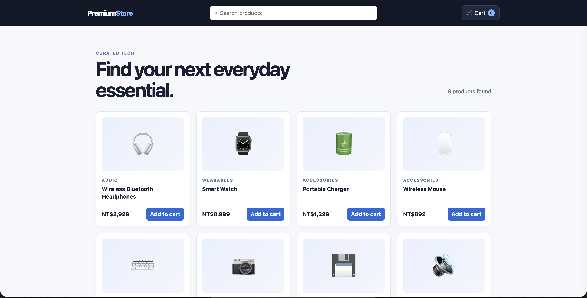

# Premium Store

A responsive React shopping-cart demo built for the Frontend Architecture Test. It provides a simple product catalog and a simulated checkout flow without requiring a backend.

## Features

- Responsive product catalog for desktop and mobile
- Debounced product search with a no-results state
- Shopping cart drawer with total item quantity and calculated order total
- Reliable repeated add/increment/decrement quantity updates
- Confirmation dialogs before removing an item or placing an order
- Toast notifications after add, remove, and checkout actions
- Disabled checkout action when the cart is empty

## Tech stack

- React 19 with functional components and hooks
- Vite development server
- esbuild bundle for static browser delivery
- Plain CSS with responsive media queries

## Run locally

```bash
npm install
npm run dev
```

Open the local URL printed by Vite, normally `http://localhost:5173/`.

## Build

```bash
npm run build
```

The build generates `app.js` and `app.css`, which are loaded by `index.html`. This also allows the completed page to be opened from a static server.

## Evidence

The following screenshot shows the running catalog with search, cart quantity badge, product cards, and add-to-cart actions.



## Project structure

```text
index.html        Static application entry point
src/main.jsx      React components and cart state
src/styles.css    Responsive visual styles
evidance.png      Browser evidence screenshot
```
